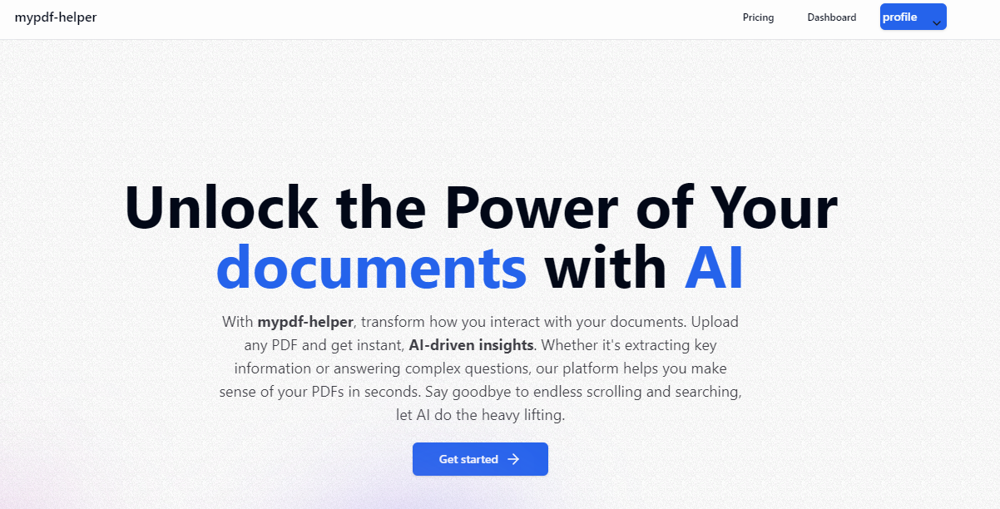

# mypdf-helper

## 📝 **Project Overview**

AI-powered SaaS platform that lets users upload, index, and interact with PDF documents using **OpenAI** and **Pinecone**. Built with Next.js App Router, TypeScript, MongoDB, TRPC, OpenAI, Pinecone, Kinde, Stripe, Uploadthing, Shadcn and TailWind CSS.

**mypdf-helper** is a cloud-based SaaS platform that empowers users to interact with their PDF documents using AI. Users can upload PDF files and engage in dynamic conversations with the document content, receiving accurate and intelligent responses based on the text within the PDF. This tool is ideal for professionals, researchers, and students who need quick and reliable insights from large documents.

## 🔗 **Links**

[](https://mypdf-helper.vercel.app/) &nbsp; &nbsp;

[](https://www.linkedin.com/in/alexkasema/)


## **Features**

- Beautiful Landing Page & Pricing Page Included
- Authentication Using Kinde
- Modern Data Fetching Using tRPC & Zod
- LangChain for Infinite AI Memory
- Pinecone as our Vector Storage
- Prisma as our ORM
- Free & Pro Plan Using Stripe
- Infinite Message Loading for Performance
- A Beautiful And Highly Functional PDF Viewer
- Streaming API Responses in Real-Time
- Intuitive Drag n’ Drop Uploads
- Instant Loading States
- Responsive design with Tailwind CSS
- Clean, modern UI on top of shadcn-ui
- Optimistic UI Updates for a Great UX

## **Technologies Used**

- **Frontend:** Next.js, TypeScript, Shadcn, TailwindCSS

- **Backend:** TRPC, MongoDB, OpenAI, Pinecone.io, Prisma

- **Authentication**: Kinde

- **Payments**: Stripe

- **File Hosting**: Uploadthing

## **Usage**

- Create Kinde account and obtain your Authentication Keys
- Create a MongoDB database and obtain your `DATABASE_URL`
- Create Uploadthing account and obtain `UPLOADTHING_SECRET`
- Create a Stripe account and obtain your

  - `STRIPE_SECRET_KEY=`

  - `STRIPE_WEBHOOK_SECRET=`

- Create Pinecone account and obtain your `PINECONE_API_KEY=`

- Create OpenAI account and obtain your `OPENAI_API_KEY`

- To upload a menu item Create a Cloudinary account and obtain your
  - CLOUD NAME
  - API KEY
  - API SECRET
  - UPLOAD PRESET

## **Environment Variables**

Rename the .env.example file to .env and add the following

`KINDE_CLIENT_ID==`

`KINDE_CLIENT_SECRET=`

`KINDE_ISSUER_URL=`

`KINDE_SITE_URL=`

`KINDE_POST_LOGOUT_REDIRECT_URL=`

`KINDE_POST_LOGIN_REDIRECT_URL=`

`DATABASE_URL=`

`NEXT_PUBLIC_SERVER_URL=`

`UPLOADTHING_SECRET=`

`PINECONE_API_KEY=`

`OPENAI_API_KEY=`

`STRIPE_SECRET_KEY=`

`STRIPE_WEBHOOK_SECRET=`

### NEXT_PUBLIC_SERVER_URL

- The NEXT_PUBLIC_SERVER_URL should point to the URL where your NextJS application is running.

## **Running the App**

### Cloning the Repository

Start by cloning the repository to your local machine:

```bash
  git clone https://github.com/alexkasema/pdf-helper.git
  cd pdf-helper
```

### Install Dependencies:

```bash
    npm install
```

### Set up environment variables.

### Run the application:

```bash
    npm run dev
```

## **Contributing**

Contributions are always welcome!

1. Fork the repository

2. Create a new branch (git checkout -b feature/your-feature).

3. Commit your changes (git commit -m 'Add some feature').

4. Push to the branch

5. Submit Pull Request with comprehensive description of changes




## License

MIT License

Copyright (c) 2024 Alex Kasema

Permission is hereby granted, free of charge, to any person obtaining a copy
of this software and associated documentation files (the "Software"), to deal
in the Software without restriction, including without limitation the rights
to use, copy, modify, merge, publish, distribute, sublicense, and/or sell
copies of the Software, and to permit persons to whom the Software is
furnished to do so, subject to the following conditions:

The above copyright notice and this permission notice shall be included in all
copies or substantial portions of the Software.

THE SOFTWARE IS PROVIDED "AS IS", WITHOUT WARRANTY OF ANY KIND, EXPRESS OR
IMPLIED, INCLUDING BUT NOT LIMITED TO THE WARRANTIES OF MERCHANTABILITY,
FITNESS FOR A PARTICULAR PURPOSE AND NONINFRINGEMENT. IN NO EVENT SHALL THE
AUTHORS OR COPYRIGHT HOLDERS BE LIABLE FOR ANY CLAIM, DAMAGES OR OTHER
LIABILITY, WHETHER IN AN ACTION OF CONTRACT, TORT OR OTHERWISE, ARISING FROM,
OUT OF OR IN CONNECTION WITH THE SOFTWARE OR THE USE OR OTHER DEALINGS IN THE
SOFTWARE.

## Contact

<p> Feel free to reach out via <a href="https://www.linkedin.com/in/alexkasema/">LinkedIn</a>, email: lexmulwa@gmail.com or open a GitHub issue if you have any questions or feedback.</p>

<p align="center"> Made with ❤ by <a href="https://github.com/alexkasema">Alex kasema</a> </p>
